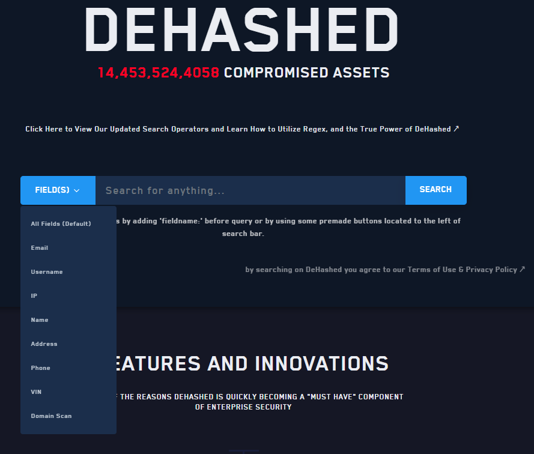

# DeHashed

## URL

[https://dehashed.com/](https://dehashed.com/)

## Description

DeHashed has compiled a searchable database of leaked personal information and  sensitive data. It allows users to search through billions of records, including **names, email addresses, usernames, IP address, physical address, phone number, vehicle identification number, and domains.**&#x20;

It is ostensibly designed for individuals and companies to detect and monitor data breaches in real time, but can also be effectively used for OSINT research.&#x20;

For example, you can use DeHashed to help search for someone who is hiding or trying to conceal their identity.&#x20;

For example, you can run an email address through DeHashed to identify  accounts your subject maintains, along with the passwords associated with those accounts. You can then go back to the DeHashed search engine and run a new search for that password, which may identify a whole new set of accounts and email addresses that use the same password. That way, you might be able to find out whether your subject is operating under an alias name or email address, all the while using and recycling the same passwords. You might also find IP addresses and location-specific accounts that can help you start spotting patterns and clues as to your subject's location or activities. &#x20;

### Step-by-step guide on how to use DeHashed

The search engine is extremely simple to use and user-friendly: you can run a keyword search either by field or across all fields:

        &#x20;

If you search by, say, email address, you will get a list of various data points associated with that email, including names and passwords. You can then run more searches against the names and passwords you identified during your original search with a view to finding more accounts and generating fresh research leads.&#x20;

\[\[ A full description of the tool, any background information needed to use it. What problem does it solve? Can you give an example use case? ]]

## Cost

* [ ] Free
* [x] Partially Free
* [ ] Paid

You have to create an account to run searches. This is relatively easy and requires only an email address and password. You can run a limited number of searches for free. However, if you want to run unlimited searches, you need to purchase a subscription.&#x20;

The current [pricing ](https://dehashed.com/pricing)information is below:&#x20;

<figure><figcaption></figcaption></figure>

## Level of difficulty

<table><thead><tr><th data-type="rating" data-max="5"></th></tr></thead><tbody><tr><td>2</td></tr></tbody></table>

## Requirements

N/A

## Limitations

DeHashed aggregates leaked data and is not a comprehensive repository of every email address, username etc. in existence. If you can't find a data point in DeHashed, it doesn't mean that it doesn't exist.&#x20;

## Ethical Considerations

Consider the ethical and legal implications of analysing and using leaked user data in your research. Carefully consider and decide whether to use this data in keeping with the nature and purpose of your work. Does the end justify the means?

## Guides and articles

DeHashed publishes a very basic (but useful) search guide [here](https://dehashed.com/search-guide), explaining how to search by field, use wildcard characters, or search a specific data origin.  &#x20;

This YouTube [video ](https://www.youtube.com/watch?v=3JztCgR85ls)provides a great demonstration of how to use DeHashed creatively to generate new research leads.

## Tool provider

Not so clear. The website's privacy policy suggests that DeHashed is registered to an address in Las Vegas, Nevada.

## Advertising Trackers

* [x] This tool has not been checked for advertising trackers yet.
* [ ] This tool uses tracking cookies. Use with caution.
* [ ] This tool does not appear to use tracking cookies.

| Page maintainer |
| --------------- |
| Ana GAP member  |
|                 |
